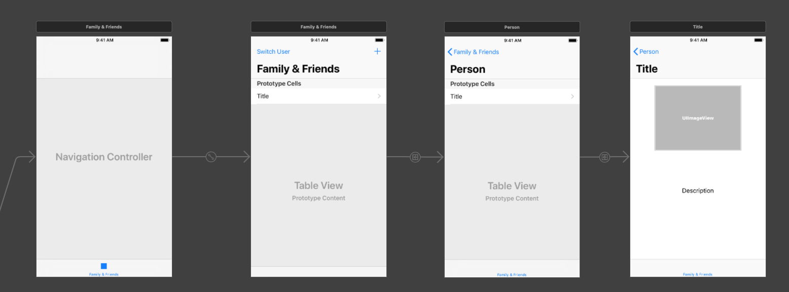
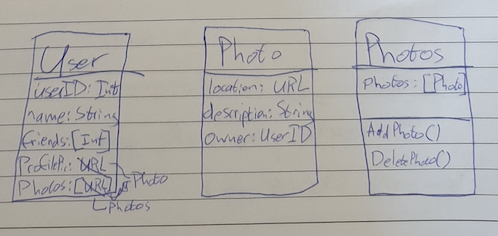
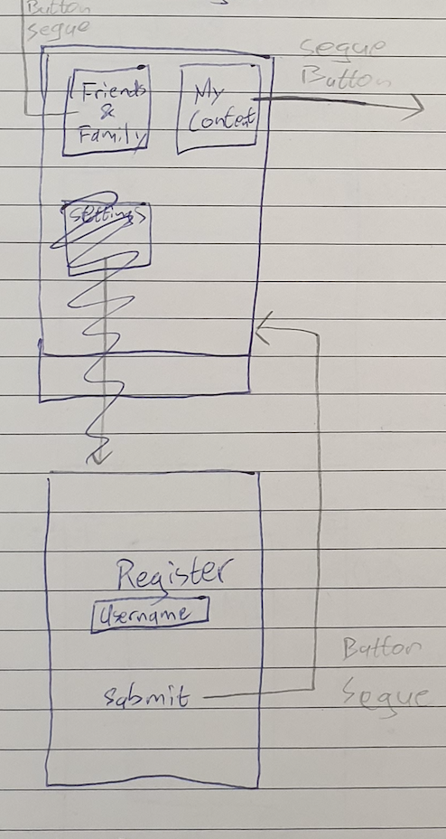
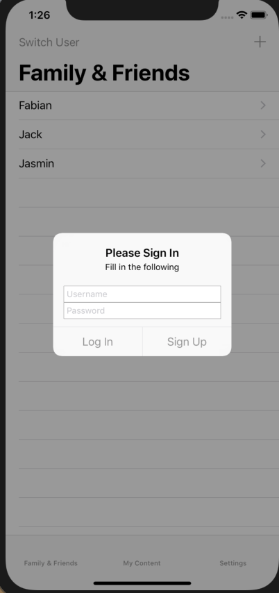
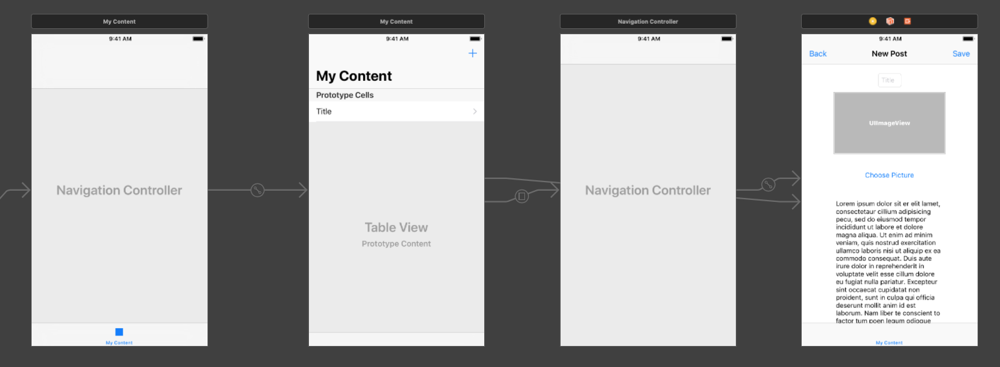
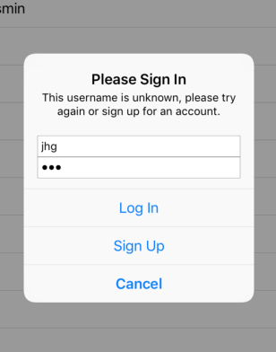

# Day 1
After meeting with the teacher I made a decision between the two apps I had in mind. I made a design, which you can find in DESIGN.md.

# Day 2, 3, 4
Made general structure; views, buttons, stacks and such.

# Day 5
In the original design, I wanted to use a page view controller to go present the contacts:

But after some solid advice I decided to opt for a simple list view controller, which I am more familiar with. This should make the process easier.

# Day 6, 7
Implemented basic transport functionality for the contacts pages

Wrote down some idea's for the User and Picture objects

# Day 8, 9, 10

Got the advice to google for Flask documentation on how to upload images. I have gotten around to creating some users and picture data objects on the server, but images don't seem to be working. I found a small bug, which gave me an error, I had a '/' in the upload folder variable, which was unnecessary. Still doesn't work though.

# Day 11

Simplified user Objects

# Day 12, 13

Found some quality Log In code: https://mycodetips.com/swift-ios/create-login-screen-alert-view-controller-using-uialertcontroller-swift-1306.html. Implemented it mostly, still need to put in the right communication with the server. This is in an alert window instead of a seperate screen as I had in my original sketches, but it works quite well.

Sketch:

Realised:

# Day 14

Downsized the user and picture objects to the essentials, added some methods to use them more easily.

# Day 15, 16

Got the fetchImages method working. Also implemented transport functionality for Users own content, decided to just use the title and image instead of the full description. This should leave some more space and make it less crowded. Also have chosen to not use profile pictures yet, first try to get the basics covered.

# Day 17

Added error messages to the log in menu

