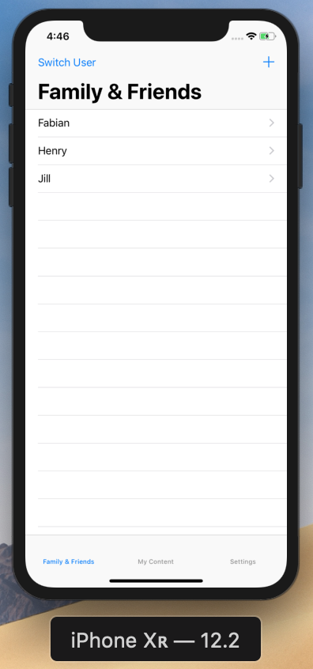
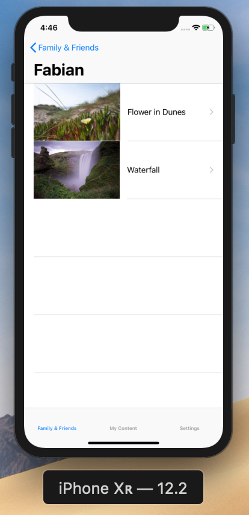
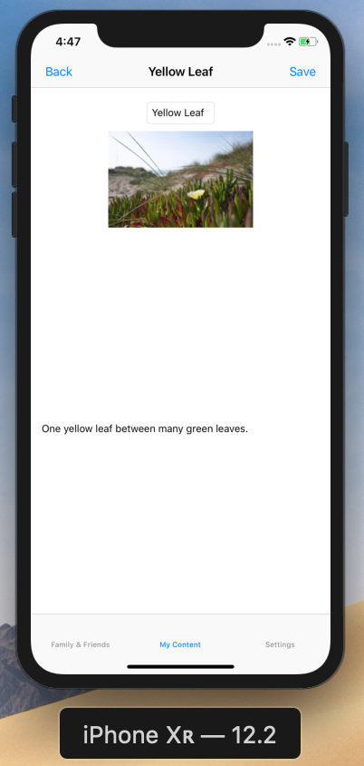
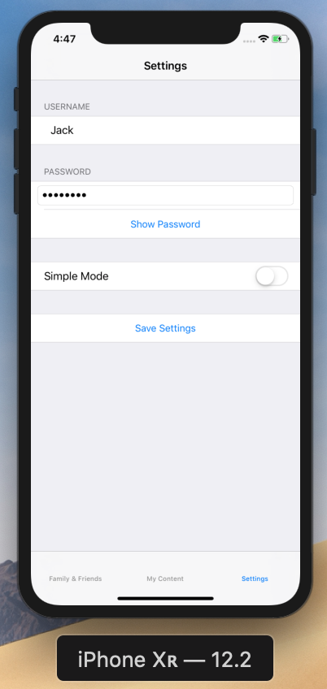

# Photobook
Photobook is an application that was written for the Programming Minor at the University of Amsterdam by Fabian de Moel. This application serves as a social medium on which people can share pictures. An additional feature is that it allows the user to choose the complexity of usage. For less tech-savvy users, the simple mode is enabled which increases the ease of use by keeping more complex features out of reach. This code is licensed as a public domain release. At the bottom of this page all the sources used in the creation of this app are listed.

Following are some screenshots of the Application:

## Sources

// Converting a dict to a string
https://stackoverflow.com/questions/26372198/convert-swift-dictionary-to-string

// Create body for request function
https://newfivefour.com/swift-form-data-multipart-upload-URLRequest.html

// Creating a login screen
https://mycodetips.com/swift-ios/create-login-screen-alert-view-controller-using-uialertcontroller-swift-1306.html

// Checking for a different user upon tabbar switch
https://stackoverflow.com/questions/33837475/detect-when-a-tab-bar-item-is-pressed
https://stackoverflow.com/questions/28099148/switch-tab-bar-programmatically-in-swift

